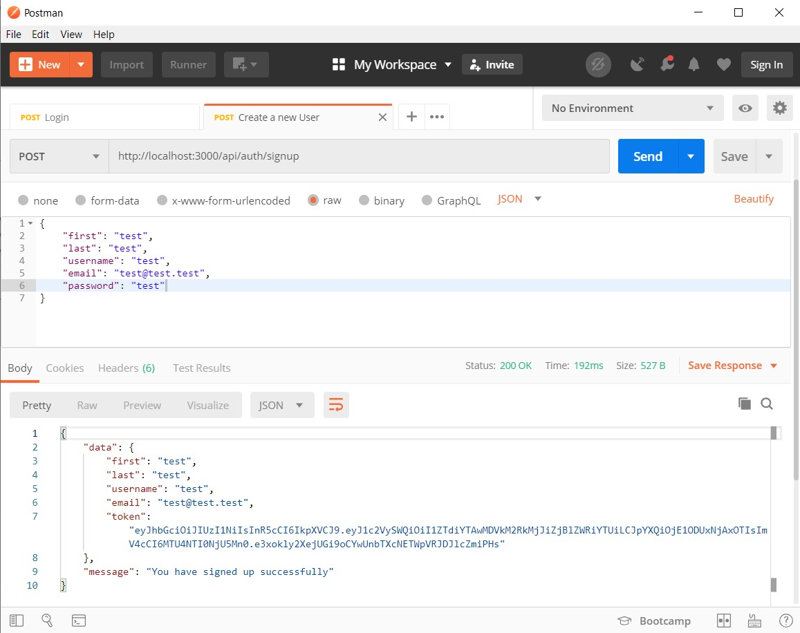
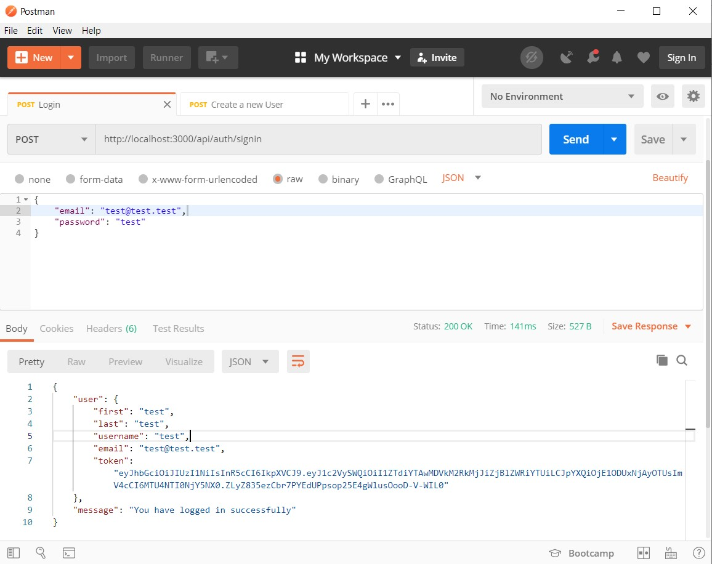

# Auth in MEN
Server side implementation of auth in Node based Express app.

# How it works
Read [here](https://nasirkhan.dev/blog/auth-in-mevn-part-1)

## Prerequisites
In order to get up & running, make sure you have following things installed

1. Node
2. NPM / YARN
2. MongoDB

## Usage

Clone this repo:

`git clone https://github.com/Lahori-Jawan/auth-in-men.git`

Next Install dependencies:

`npm install`

Run the server;

`npm run dev`

Make requests to signin/signup users: (Optional)

**Create new User**

**Signin User**

